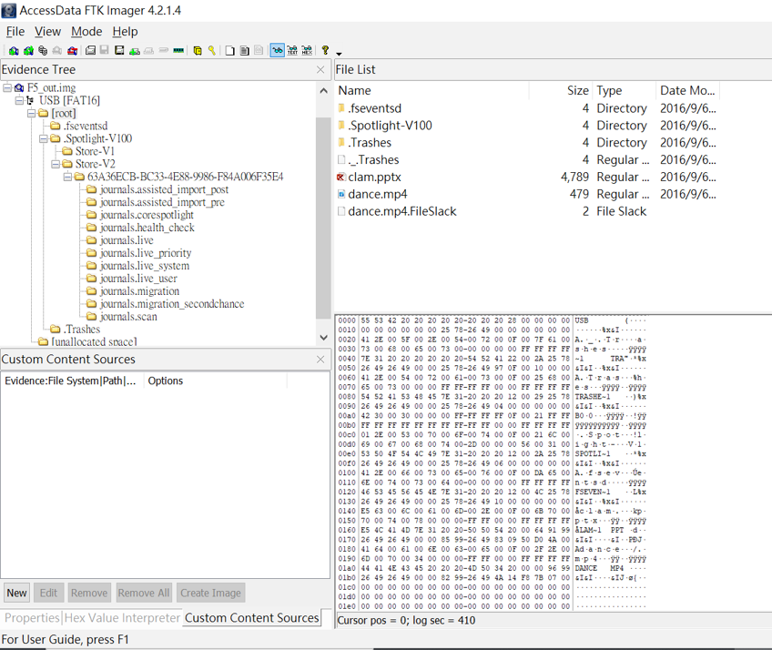

# Forensics_CTF.md
- [網址](http://120.114.62.203)

# Forensics_CTF_2022
- [CTFlearn:The most beginner-friendly way to learn cyber security.](https://ctflearn.com/)
- [簡單的解答](https://deskel.github.io/posts/ctflearn/forensics-easy)


# DF1_File/System Forensics

### DF_A1_1:[Word Forensics 1](https://docs.google.com/document/d/1_3-O20roC7I9SxcBWioer4wPxhkT1eLg/edit?usp=sharing&ouid=102749267313503387480&rtpof=true&sd=true)


### DF_A1_2:[Word Forensics 2](https://docs.google.com/document/d/1F3W1RsKP-uLG9t-8yv5i7XiZvsKH7ra5/edit?usp=sharing&ouid=102749267313503387480&rtpof=true&sd=true)


### DF_B1_1:Image steg1: [Metadata](https://drive.google.com/file/d/1lq-lknfV5O7M-qEsEgmK3WCpWQ0NjkmZ/view?usp=sharing)
- [exiftool](https://exiftool.org/)

### DF_B1_2:Image steg2: [File carving](https://drive.google.com/file/d/1JAG2oJuxxy6T0Gc2yJKdkKT9YIlG1oAm/view?usp=sharing)

### DF_C1_1:[practical FTK imager](https://drive.google.com/file/d/1vuaPPeYTHxMg__eCbAtfZHBx27eJLfmN/view?usp=sharing)

### DF_C1_2:[practical Autopsy1](https://drive.google.com/file/d/1tne2H7JH8LKslphqA_fYOgLRivcdbSP9/view?usp=sharing) ==> 使用web

### DF_C1_3:[practical Autopsy2](https://drive.google.com/file/d/1OxNn0L4p7vW-nzr1XvzDCt37v8Iw0dOk/view?usp=sharing)
- 也試著用FTK imager解此題

| FTK imager | Autopsy |
|--------|----------|
| | |


# Memory Forensics
- [Volatility 3(2020最新版python3)]()
- [Windows standalone](https://www.volatilityfoundation.org/releases)(Volatility 2.6)
- Kali Linux 2019.2版(內建Volatility 2.6)
  - whereis volatility
    - volatility: /usr/bin/volatility /usr/share/volatility /usr/share/man/man1/volatility.1.gz
  - volatility -h
    - Volatility Foundation Volatility Framework 2.6
    - Usage: Volatility - A memory forensics analysis platform.
- Kali Linux 2021.3(沒有內建Volatility)
  - 最簡單就是下載Volatility 2.6 see [(EASIEST) Install Volatility on Kali Linux (Standalone)](https://www.youtube.com/watch?v=iJzndSbkN4Y)

### 課程演練 [Defcon 2019 DFIR CTF](https://defcon2019.ctfd.io/challenges) 
- [題目下載 請下載Triage-Memory.mem](https://drive.google.com/drive/folders/1JwK8duNnrh12fo9J_02oQCz8HlILKAdW)
- [參考解答](https://www.jaiminton.com/Defcon/DFIR-2019/)
- 使用linux版本解比較完整
- 使用Windows 版本解欠缺強大的grep 功能(待補強 findstr)

### Memory Forensics Analysis with Volatility | TryHackMe Volatility
- [Room Link](https://tryhackme.com/room/bpvolatility)
- [解題影片](https://www.youtube.com/watch?v=Ha-TXEvSAIM)

### Malware memory analysis

- [Malware - Cridex](https://github.com/volatilityfoundation/volatility/wiki/Memory-Samples)
  - 參考 [Digital Forensics with Kali Linux第一版 Chapter 7. Memory Forensics with Volatility](https://subscription.packtpub.com/book/networking-and-servers/9781788625005/7/ch07lvl1sec49/using-volatility-in-kali-linux) 
  - volatility -f cridex.vmem imageinfo
  - Process identification and analysis  ==> pslis| psscan | psxview
    - volatility -f cridex.vmem --profile=WinXPSP3x86  pslist
    - volatility -f cridex.vmem --profile=WinXPSP3x86  psscan
  - Analyzing network services and connections ==> connections | connscan | sockets
    - volatility -f cridex.vmem --profile=WinXPSP3x86 connections
  - DLL analysis ==> verinfo | dlllist |getsids
    - volatility -f cridex.vmem --profile=WinXPSP3x86 verinfo
  - Registry analysis ==> hivescan | hivelist
    - volatility -f cridex.vmem --profile=WinXPSP3x86 hivescan
  - Password dumping ==>see hivelist
  - Timeline of events ==> timeliner
    - volatility -f cridex.vmem --profile=WinXPSP3x86 timeliner
  - Malware analysis  ==> malfind
    - volatility -f cridex.vmem --profile=WinXPSP3x86 malfind
    - volatility -f cridex.vmem --profile=WinXPSP3x86 malfind -p 608
      - winlogon.exe is assigned the PID 608. To run malfind on PID 608

- [Malware-R2D2 (pw: infected)](https://github.com/volatilityfoundation/volatility/wiki/Memory-Samples)
  - 參考 [Digital Forensics with Kali Linux第2版](https://subscription.packtpub.com/book/security/9781838640804/10/ch10lvl1sec54/downloading-test-images-for-use-with-volatility) 
    - [Dev Tutorials](https://goois.net/chapter-7-memory-forensics-with-volatility-digital-forensics-with-kali-linux-second-edition.html)

- [Malware Analysis: Memory Forensics with Volatility 3](https://newtonpaul.com/malware-analysis-memory-forensics-with-volatility-3/)
- [Analysing Fileless Malware: Cobalt Strike Beacon](https://newtonpaul.com/analysing-fileless-malware-cobalt-strike-beacon/)
### MemroyForenisc_4_MiniCTF.md

- [下載image](https://drive.google.com/drive/folders/1E-i2RTUBXBGUd_Xz0k67kFOpHcr6WX8J)
- [CTF說明Mini Memory CTF - A Memory Forensics Challenge](https://www.youtube.com/watch?v=JuEv8UleO0U)
- 四道題目
```
Question #1
Find the running rogue (malicious) process. 
The flag is the MD5 hash of its PID.

Question #2
Find the running rogue (malicious) process and dump its memory to disk. 
You'll find the 32-character flag within that process's memory.

Question #3
What is the MAC address of this machine's default gateway? 
The flag is the MD5 hash of that MAC address in uppercase with dashes (-) as delimiters. 
Example: 01-00-A4-FB-AF-C2.

Question #4
Find the full path of the browser cache created when an analyst visited "www.13cubed.com." 
The path will begin with "Users\." 
Convert the path to uppercase. 
The flag is the MD5 hash of that string.
```
- [解答](https://www.13cubed.com/downloads/mini_memory_ctf_solutions_guide.pdf)

# Network Forensics

### N1:[simple Network Forensics](https://drive.google.com/file/d/1G2eLJmyY--SKKG3JMY0Bfs4tujZjnABC/view?usp=sharing)
### N2:[TCP traffic](https://drive.google.com/file/d/1cvflhwzSw_glo0zdxWdIpXwD67Wqgwx7/view?usp=sharing)
### N4:[UDP traffic](https://drive.google.com/file/d/17BVwWVg1ot_nlDHcg5B9VsrklQtOrtYj/view?usp=sharing)
### N5:[Http basic Authentication](https://drive.google.com/file/d/19VHi6q_fghKVuZoKntD9uaKSjpjxPMCP/view?usp=sharing)  [檔案2](https://drive.google.com/file/d/1ADA0u1RCyQ8rqvwQE8n-bIUuO6cw_U8R/view?usp=sharing)
### N6:[Web browser Version](https://drive.google.com/file/d/1B3nf9sPxAETjPYLsjcNyysk270BQcjQl/view?usp=sharing)
### N7:[TLS traffic analysis](https://drive.google.com/file/d/1Gp5zynQie4cb9wKAqjskxkptorIBzrPU/view?usp=sharing)
